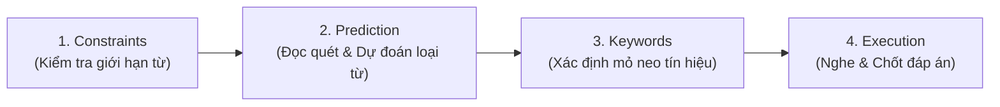

# 🎧 Chiến Thuật Xử Lý Dạng Bài Gap-Fill & Map Labelling (IELTS Listening)

> **Kỹ năng:** Listening (Part 1, 2, 4)  
> **Dạng bài:** Gap-Fill (Điền vào chỗ trống) & Map / Plan Labelling (Gắn nhãn bản đồ)  
> **Mục tiêu:** Tối ưu độ chính xác thời gian thực, triệt tiêu bẫy và nâng band 8.0+  
> **Ngày cập nhật:** 2026-10-08  
> **Thẻ phân loại:** `#listening` `#gap-fill` `#map-labelling` `#strategies` `#band8plus`

---

## 🧩 PHẦN 1: Quy Trình 4 Bước Xử Lý Dạng Bài Gap-Fill (Điền Vào Chỗ Trống)

Dạng bài điền từ xuất hiện nhiều nhất ở **Part 1** (form/notes) và **Part 4** (academic lecture). Để không bị "trôi" theo tốc độ nói của băng, bạn cần xử lý thông tin theo chuỗi thuật toán 4 bước:

### 1. 🛑 Xác Định Giới Hạn (Constraints Analysis)
- Đọc kỹ yêu cầu đề bài trước tiên:
  - `ONE WORD ONLY`: Tuyệt đối chỉ điền đúng 1 từ duy nhất.
  - `NO MORE THAN TWO WORDS AND/OR A NUMBER`: Tối đa 2 từ và/hoặc 1 số.
- **Cảnh báo lỗi ngớ ngẩn:** Điền thừa dù chỉ 1 mạo từ (*a, an, the*) hay giới từ khi đề yêu cầu `ONE WORD` đều bị chấm 0 điểm.

### 2. 🔍 Đọc Quét & Dự Đoán Dữ Liệu (Scanning & Type Prediction)
- Đọc lướt cả câu chứa chỗ trống để nắm ngữ cảnh vĩ mô.
- **Dự đoán "Kiểu Dữ Liệu" (Data Typing):**
  - **Từ loại:** Danh từ (Noun), Động từ (Verb), Tính từ (Adj), Trạng từ (Adv)?
  - **Định dạng đặc thù:** Tên riêng (Name), Ngày tháng (Date), Số điện thoại (Number), Tiền tệ (Price), Địa chỉ (Address)?
  - **Dạng số:** Nếu là danh từ, cần chú ý xem ngữ cảnh yêu cầu **Số ít hay Số nhiều** (ví dụ: sau *many, several* hoặc động từ số nhiều).

### 3. ⚓ Xác Định Mỏ Neo Tín Hiệu (Anchor Keywords)
- Khoanh vùng các từ khóa mang tính định vị (khó bị thay thế hoặc paraphrase):
  - Tên riêng, năm tháng, thuật ngữ chuyên môn.
  - Các liên từ chỉ chuyển ý (*however, although, in addition, because*).
- **Quy tắc mỏ neo:** Xác định từ đứng ngay **trước** và **sau** chỗ trống để làm "tín hiệu kích hoạt" (trigger point) khi audio phát tới.

### 4. 🎯 Thực Thi (Execution & Verification)
- Khi băng chạy tới từ khóa mỏ neo $\rightarrow$ tập trung bắt chính xác từ cần điền.
- **Kiểm tra ngữ pháp tức thì:** Sau khi viết xong, liếc nhanh xem từ đó có đúng ngữ pháp của câu không (hòa hợp chủ - vị, dạng từ, đuôi *-s/-es*).

---

## 🗺️ PHẦN 2: Phương Pháp Tiếp Cận Dạng Bài Map / Plan Labelling (Bản Đồ)

Dạng Map thường gây hoang mang vì tốc độ nói liên tục và đòi hỏi phản xạ định vị không gian theo thời gian thực (Real-time Spatial Tracking). 

> [!WARNING]
> **Điểm yếu phổ biến:** Chỉ học thuộc nghĩa từ vựng phương hướng (*turn left, opposite, adjacent*) nhưng không kịp chuyển hóa thành hình ảnh không gian khi nghe băng.

### 🛠️ Kỹ Thuật Trực Quan Hóa (Spatial-Audio Mapping)

#### 1. Định Vị Điểm Xuất Phát (Starting Point)
- Luôn tìm ký hiệu **"You are here"**, cổng chính (**Main Entrance / Reception / Front Gate**), hoặc ngã ba/ngã tư chính trước khi nghe.
- Đặt đầu ngón tay hoặc ngòi bút ngay tại điểm xuất phát này.

#### 2. Dựng "La Bàn Định Hướng" (Compass Orientation)
- Nhìn nhanh góc bản đồ: Có la bàn **North (N) - South (S) - East (E) - West (W)** không?
  - Nếu có la bàn $\rightarrow$ Người nói chắc chắn sẽ dùng: *to the north of, eastern side, north-east corner...*
  - Nếu không có la bàn $\rightarrow$ Người nói sẽ dùng phương hướng theo mắt người: *on your left, to your right, straight ahead, at the top/bottom...*

#### 3. Kỹ Thuật Vẽ Đường Đi Trực Quan (Pen Tracing Technique)
- **Vẽ đường đi thời gian thực:** Khi băng nói người đi di chuyển theo hướng nào, hãy **lướt ngòi bút chạy theo đúng lộ trình đó** trên đề bài.
- Không nhảy mắt lung tung giữa các phòng; để ngòi bút đóng vai trò là "vật thể di chuyển" trên bản đồ.

#### 4. Giải Mã Ngôn Ngữ Không Gian Thường Gặp

| Thuật Ngữ Không Gian | Ý Nghĩa Thực Tế Trên Bản Đồ | Vị Trí Điển Hình |
| :--- | :--- | :--- |
| **Opposite / Across from** | Đối diện (thường cách nhau bởi lối đi/con đường) | Bên kia hành lang hoặc bên kia đường |
| **Adjacent to / Next to / Beside** | Ngay sát bên cạnh (chung một vách tường) | Phòng liền kề |
| **In the far corner** | Nằm sâu ở góc khuất nhất | Góc xa của tòa nhà/khu đất |
| **Clockwise / Anti-clockwise** | Theo chiều kim đồng hồ / Ngược chiều kim đồng hồ | Thường dùng cho đường vòng (circular path) |
| **Just past the... / Bend** | Vừa đi qua khỏi một địa điểm / Khúc cua | Ngay sau khúc ngoặt |
| **Lead off / Branch off** | Lối đi rẽ nhánh ra từ con đường chính | Các ngã rẽ nhánh phụ |

---

## 💡 Bảng Checklist Tự Kiểm Tra Khi Luyện Listening

- [ ] Luôn gạch chân số lượng từ được phép điền trước khi nhìn vào câu hỏi.
- [ ] Luôn dự đoán loại từ và dạng danh từ (số ít/số nhiều) cho dạng Gap-Fill.
- [ ] Luôn đặt sẵn ngòi bút tại điểm xuất phát (**You are here**) cho dạng Map.
- [ ] Khi bị lỡ mất 1 câu, **bỏ qua ngay lập tức** và định vị lại từ khóa câu tiếp theo để tránh hiệu ứng domino.

---

## 🔗 Mạng Lưới Kiến Thức Liên Quan (Knowledge Network)

- 📅 **Lịch trình hôm nay:** [[study-planner|Sổ kế hoạch học tập]] *(Phiên thực chiến Listening Baseline 45p tối nay)*
- 🌐 **Nguồn làm đề:** [[resources-learning-tools|Kho tài liệu luyện thi]] *(Bộ đề Cambridge 18/19 & Mini-ielts)*
- 🎯 **Lộ trình điểm số:** [[roadmap-5.0-to-7.5|Lộ trình tổng thể 5.0 lên 7.5]] *(Mục tiêu gánh điểm: Listening 8.0 - 8.5)*

